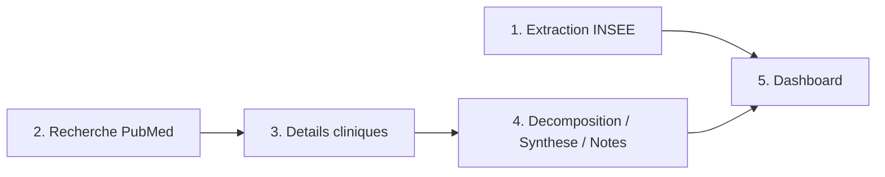

# Playbook — Recherche Santé & Fertilité

> Guide opératoire structuré en 4 volets (Définitions / Process / Documentation / Templates).
> Rappel : projet personnel (Track B), pas un avis médical, données réelles (INSEE, PubMed) — voir [`README.md`](README.md) et [`../PROTOCOLE_ANALYSE_FERTILITE.md`](../PROTOCOLE_ANALYSE_FERTILITE.md).
> **Dernière mise à jour** : 03/09/2026

---

## 1. Définitions

| Terme | Définition |
|---|---|
| **Sujet suivi** | Une requête PubMed fixe déclarée dans `SUJETS` (`src/recherche_pubmed.py`), mise en cache — par opposition à une recherche libre calculée à la volée |
| **Résumé bref** | 1-2 phrases tirées du texte réel du résumé PubMed (conclusion, effet observé, ou à défaut définition du sujet) — jamais une reformulation |
| **Niveau de preuve** | Hiérarchie déclarative (méta-analyse > essai randomisé > cohorte > cas-témoins), détectée par mots-clés dans le type d'étude déjà extrait — `⚪ Non déterminé` si le type n'est pas identifiable, jamais deviné |
| **Décomposition par mots-clés** | Cartographie déclarative français → catégorie PubMed (`config/categories_problematique.yaml`), sans IA — méthode par défaut |
| **Groundage strict** | L'IA (décomposition, synthèse, traduction) ne propose/transforme que du texte déjà réel, jamais un résultat scientifique inventé — les vraies études viennent toujours de PubMed |
| **Facteur / solution évoqué(e)** | Étude classée par mots-clés (pas d'IA) comme évoquant un facteur de risque possible ou une piste de traitement étudiée (`src/facteurs_solutions.py`) — une même étude peut apparaître dans les deux, jamais un choix exclusif |

---

## 2. Process

1. **Extraction INSEE** (`src/extraction_insee.py`) — API Melodi officielle, séries de fécondité par âge et âge moyen à la maternité, mesures identifiées empiriquement (pas de documentation officielle des codes trouvée).
2. **Recherche PubMed** (`src/recherche_pubmed.py`) — `esearch`/`esummary` sur les sujets suivis (`SUJETS`) ou une requête libre (`rechercher_requete_libre`), toujours avec un vrai PMID vérifiable.
3. **Détails cliniques** (`src/extraction_details_etudes.py`) — `efetch` sur l'abstract réel, extraction déclarative (regex, `config/patterns_cliniques.yaml`) du dosage/durée/effectif/type d'étude, et repli en cascade pour le résumé bref : conclusion → effet observé → description générale isolée du corps de l'abstract si aucune section structurée n'existe (cas fréquent des revues, voir §11-15 du protocole).
4. **Décomposition / Synthèse / Notes** (`src/decomposition_problematique.py`, `src/synthese.py`, `src/facteurs_solutions.py`, `src/notes_perso.py`) — décompose une problématique complète en catégories (mots-clés par défaut, IA en option), synthétise un ensemble d'études par niveau de preuve et direction, regroupe les études par facteurs possibles / solutions étudiées (mots-clés, ajouté le 03/09), permet une note personnelle par PMID (jamais publiée).
4bis. **Traduction** (`src/traduction.py`) — Google Translate via `deep-translator`, deux usages : repli d'une requête libre tapée en français vers l'anglais si 0 résultat (PubMed n'indexant quasiment que l'anglais), et traduction à l'affichage du texte scientifique (titre, résumé, effet, conclusion, extraits facteurs/solutions) — texte original anglais toujours accessible à côté. Timeout de 8s par appel (thread), jamais de blocage total du dashboard si le service traîne.
5. **Dashboard** (`dashboards/app.py`) — 3 onglets (recherche libre, sujets suivis, depuis une problématique), suggestions cliquables (une vingtaine de problématiques connues), tout le texte affiché en français, badge de niveau de preuve, synthèse et regroupement facteurs/solutions sur chaque liste d'études.

**Point de décision réutilisable** : un résumé bref ne doit jamais rester vide juste parce que l'étude n'a pas de section RESULTS/CONCLUSION structurée — une revue narrative contient presque toujours une phrase de définition du sujet dans ses premières lignes, qu'on peut isoler sans jamais reformuler (`extraire_description_generale`). Découvert en production, pas en testant : une recherche libre à un seul mot ("PCOS") est le cas le plus fréquent, pas un cas rare.

---

## 3. Documentation

- [`README.md`](README.md) — vue d'ensemble, lancement local, démo live.
- [`../PROTOCOLE_ANALYSE_FERTILITE.md`](../PROTOCOLE_ANALYSE_FERTILITE.md) — sources vérifiées, problématique, méthodologie complète, historique des ajustements (15 sections).
- [`config/categories_problematique.yaml`](config/categories_problematique.yaml) — catégories de décomposition, mots-clés déclencheurs, réutilisées comme suggestions cliquables dans l'onglet recherche libre.
- [`config/patterns_cliniques.yaml`](config/patterns_cliniques.yaml) — patterns d'extraction déclaratifs (dosage/durée/effectif/type d'étude).

---

## 4. Templates

**Ajouter un sujet suivi** : ajouter une entrée dans `SUJETS` (`src/recherche_pubmed.py`) avec une requête PubMed testée en direct (`esearch`) avant de la figer — jamais supposer qu'une requête retournera des résultats.

**Ajouter une catégorie de décomposition** : ajouter une entrée dans `config/categories_problematique.yaml` (`nom_categorie`, `requete_pubmed`, `mots_cles` déclencheurs en français).

**Ajuster le repli du résumé bref** : la cascade conclusion → effet observé → description générale est dans `resumer_brievement()` (`src/extraction_details_etudes.py`) — chaque niveau reste un extrait du texte réel, jamais une reformulation IA.

---

*Gisèle Metouck — Consultante Data Steward & Gouvernance · [GitHub](https://github.com/Kingdmfncr)*
